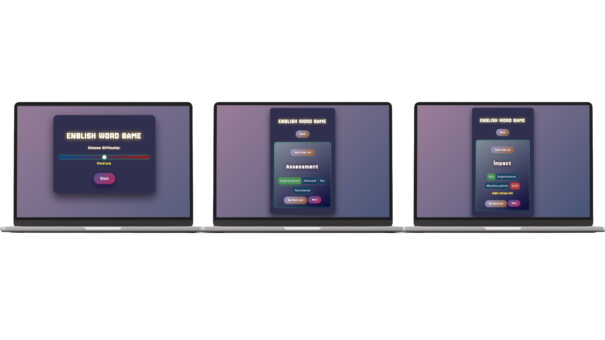
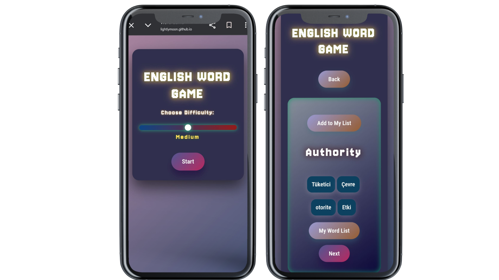

# 🎮 English Word Game — Interactive Vocabulary Challenge

### A Fully Responsive English Word Guessing Game

 

 

## 🌐 Live Demo

👉 **[Click here to see the live demo](https://lightlymoon.github.io/English-Word-Game/)**

---

# 📱 User Interface Preview

## Desktop Views 

---

## Mobile Views

  

---
# ✨ Overview

**English Word Game** is a fully responsive, browser-based word guessing game built using pure HTML, CSS, and JavaScript.

The game displays a random English word from a local dataset and challenges the user to guess letters. It updates the UI dynamically based on user input and game progression.

This project showcases essential front-end programming skills without relying on external APIs or third-party libraries.

---

# 🎯 Core Features

## 🟡 Random Word Generation
- Word list stored locally in a JavaScript array
- Random selection of a new target word per game
- Unpredictable gameplay each session

## 🔤 Interactive Guessing Logic
- Validates user letter input
- Reveals correct letters in the word
- Tracks remaining attempts
- Displays win/loss feedback

## 📱 Fully Responsive Design
- Works on desktop, tablet, and mobile screens
- Flexible layout using responsive CSS
- Clear visual hierarchy for game elements

## ⚡ Client-Side State Handling
- Zero external API usage  
- No dependencies or build tools  
- Fully client-rendered game behavior

---

# 🧠 Technical Architecture

The application is structured to separate UI rendering and game logic clearly.

### Key Concepts Used

- Local data array for word storage  
- Random selection algorithm  
- Event listeners for form submission  
- DOM updates based on game state  
- Conditional rendering of UI elements  
- Responsive CSS layout techniques

---
## ⭐ Support ⭐ 
⋆⭒˚.⋆ If you like this project, do not forget to give a star ⋆⭒˚.⋆

  ⚠️ This README is uniquely designed by <strong>@lightlymoon.</strong>

